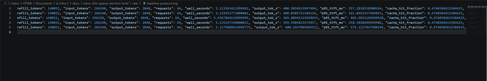
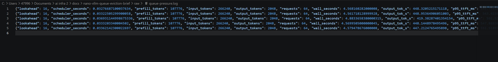

# nano-vLLM：队列感知 KV Cache 淘汰优化

[核心代码差异](docs/queue-aware-eviction.patch) · [原始实验数据](docs/raw)

## 实验配置

RTX 5080 / Qwen3-0.6B / BF16 / 单卡 / CUDA Graph。每轮 64 个请求，分 8 波提交，每个请求输入 4160 tokens、输出 32 tokens；KV cache 限制为 68 个物理 blocks，每块 256 tokens，制造缓存竞争。

对照组关闭优化（`lookahead=0`），实验组开启优化（`lookahead=16`）。使用相同请求轨迹，两组各预热一次，再交替顺序测量 5 对，结果取正式运行的算术平均。

## 基线测试



平均吞吐为 **394.05 tokens/s**，每轮实际执行 **140032 prefill tokens**，平均每轮 p95 TTFT 为 **571.16 ms**。

### 发现问题

分析 Scheduler 与 BlockManager：请求结束后，引用计数归零的 block 进入空闲队列，其缓存前缀仍可能被复用。原策略按空闲队列顺序取块，没有考虑等待队列的近期需求。

因此，当前请求可能覆盖后续请求马上需要的前缀；后续请求被调度时，又必须执行 prefill。优化目标是减少这类可以避免的重算。

## 引入队列感知淘汰

### 解决方案

当分配将覆盖有效缓存时，检查等待队列前 16 个条目，跳过当前请求和已有 block table 的请求；只读查询连续缓存前缀，遇到第一个 miss 就停止，将匹配的 block ID 加入临时保留集合。

优先分配集合外的空闲块；如果全部候选块都在集合内，仍按原顺序分配。保留只是降低淘汰优先级，不锁定显存。集合在每次分配调用内惰性构建和复用，不改变引用计数规则和请求调度顺序。

<details>
<summary><strong>展开原理详解</strong></summary>

### 原理详解

#### 1. KV Cache 缓存了什么

自回归推理中，每层 Attention 都会为 token 计算 Key 和 Value。后续 token 可以读取已计算的 K/V，避免重复计算历史 token。Automatic Prefix Caching（APC）进一步允许不同请求复用相同输入前缀的 K/V，减少新请求的 prefill 计算。

这里复用的是**从输入起点开始、上下文一致的连续前缀**。仅仅某一段 token 相同还不够：同一段文字出现在不同上文后，其 K/V 也可能不同。

#### 2. 物理 block 与每个请求的 block table

GPU 上的 KV Cache 被划分成固定大小的物理 block；本实验每块容纳 256 个 token 对应的 KV。每个 Sequence 都有自己的 `block_table`，将该请求的逻辑块映射到物理 block ID。不同请求可以共享相同的缓存前缀，因此多个 block table 可以指向同一个物理块。

例如：

```text
seq A.block_table = [7, 12, 20]
seq B.block_table = [7, 12, 25]

物理块 7、12 被两个请求共同引用，ref_count = 2
物理块 20、25 各被一个请求引用，ref_count = 1
```

`Block` 对象中的 `token_ids` 和 `hash` 是 CPU 侧用于识别缓存的元数据；真正的 K/V 数值存放在 GPU 的 KV Cache 张量中。

#### 3. 请求结束不等于立即擦除缓存

`deallocate(seq)` 遍历该请求的 block table，对每个物理块执行 `ref_count -= 1`，然后清空**该请求自己的** block table，并将其 `num_cached_tokens` 归零。

| 释放后的引用计数 | 物理块的处理 |
|---|---|
| 仍大于 0 | 继续留在 `used_block_ids` 中，供其他请求使用 |
| 等于 0 | 从 `used_block_ids` 移除，加入 `free_block_ids` 队尾 |

这一过程不清空 block 的 `hash`、`token_ids`，也不将 GPU 上的旧 K/V 清零。所以，**free 表示允许重新分配，不表示其中没有可复用的缓存**。

此后有两条不同路径：

- **命中旧前缀：** 将对应空闲块从 free 队列取出，引用计数设为 1，加入新请求的 block table；保留旧元数据和 K/V。若该块仍被其他请求使用，则增加引用计数。
- **作为新块重新分配：** 删除仍指向该物理块的旧 hash 映射，执行 `reset()`，将引用计数设为 1、hash 设为 −1、token 列表清空。GPU 上对应位置的 K/V 随后由模型计算写入；`reset()` 本身不是清零 GPU 显存。

本优化改变的是第二条路径中“选择哪个空闲物理块”。

#### 4. 原策略为什么会造成额外 prefill

原策略从 `free_block_ids` 队头分配新块。块在引用归零时进入队尾，所以这里准确地说是**按空闲队列顺序回收**，不能简单理解为维护了每次访问时间的严格 LRU。

假设当前请求 A 需要一个新块，而等待中的请求 B 很快会复用物理块 P：

```text
空闲队列： [P, Q, R]
当前请求： A 需要新块
后续请求： B 的连续缓存前缀包含 P

原策略：给 A 分配 P → P 的旧缓存失效
稍后 B 入场：前缀查询在 P 处 miss → 从该位置开始重新执行 prefill
```

原策略已经检查了 A 自身能否命中缓存，但分配 A 所需的新块时，没有考虑 B 的近期复用需求。这是本优化要解决的问题。

#### 5. 队列感知淘汰如何执行

实现按以下顺序工作：

1. **先处理当前请求自己的复用。** `can_allocate()` 查询当前请求能命中的连续前缀并判断容量；`allocate()` 先引用这些命中块，再为剩余部分分配新块。
2. **必要时才查询等待队列。** `_allocate_blocks()` 发现普通分配将取出的队头块带有效 hash 时，才惰性构建保留集合；如果一直分配的是没有有效缓存的块，就不执行查询。
3. **有界检查近期请求。** Scheduler 通过 `islice(waiting, prefix_cache_lookahead)` 提供等待队列前若干条目。`lookahead=16` 表示最多检查前 16 个条目，跳过当前请求和已经有 block table 的请求。prefill 时当前请求通常就在队头，因此最多还会检查其中 15 个其他请求；不会跳过后再补足 16 个。
4. **收集连续命中的块。** 对每个候选请求，从第一个逻辑块开始计算链式 hash、查找映射并核对 token 内容，第一次 miss 就停止，将此前命中的物理 block ID 加入 `retained` 集合。查询范围为 `range(seq.num_blocks - 1)`，与当前分配逻辑一致，排除请求的最后一个逻辑块，为实际前向计算保留后缀。
5. **优先回收集合外的块。** 队头不在集合中时直接取出；队头在集合中时，沿 free 队列找到第一个集合外的块进行分配。若找不到，仍取原队头，不阻止分配。

例如，假设本次分配期间集合不变，且没有其他复用或释放操作：

```text
原空闲顺序： [A, B, C, D, E]
保留集合：   {B, D}
连续分配顺序：[A, C, E, B, D]
```

查询不会增加引用计数，也不会修改请求的 block table 或空闲队列。真正分配时仍通过 `_allocate_block()` 完成旧映射清理和引用状态更新。集合可能包含正在使用的块，但候选选择只遍历 free 队列，不会淘汰仍被引用的块。

`retained` 是一次 `_allocate_blocks()` 调用内的局部状态，构建后供该调用的后续取块复用，调用结束后不再使用。Decode 跨 block 边界需要新块时，也经过这条路径。

#### 6. 前面的块被覆盖，为什么不会错误命中后面的块

块的 hash 包含前缀信息，可以抽象为：

```text
H1 = hash(tokens_1)
H2 = hash(H1, tokens_2)
H3 = hash(H2, tokens_3)
```

覆盖第二个物理块时，不会连带修改第三个块保存的 hash。但新请求的查询从第一块开始，并且只接受**连续命中**：

```text
第一块命中 → 第二块旧缓存已失效 → 立即停止
第三块即使还保存旧 hash，也不会被加入可复用前缀或保留集合
```

所以不会“跳过已经失效的第二块，直接把第三块当成可复用前缀”的情况。若前两块后来被正确重算并重新建立缓存，之后的查询才可能继续命中第三块。链式 hash 区分前缀上下文，连续查询保证本次复用不会跨过缺失的块；这延续了原有前缀匹配机制，并未引入额外的 hash 碰撞保证。

#### 7. 收益、开销与适用范围

优化的收益链条是：**保留近期会用到的前缀 → 后续请求多命中缓存 → 少执行 prefill → 在相同输出工作量下缩短耗时、提高吞吐。** 不压缩单个 token 的 KV，不增加物理块数量，也不直接加速 Attention kernel。

代价来自 CPU 上的前缀 hash 计算、字典查询和 free 队列扫描。设被检查请求的候选前缀块总数为 P，空闲块数为 F，则保留集合需要查询至多 P 个块，hash 成本还取决于块内 token 数；队头被保留时，单次找替代块及 deque 移除操作最坏为 O(F)。限制请求数可以约束查询范围，但不代表全部开销都是常数。

如果全部空闲块都被保留，算法仍回退到原队列顺序。保留集合不“锁住”显存，所以本来可行的分配不会仅因保留策略而失败。代价是保留只是尽力而为，不能保证后续请求一定命中。

本实验的吞吐提升来自重复长前缀且缓存紧张的负载。缓存充足、前缀几乎不共享，或 CPU 查询成本超过节省的 GPU 计算时，收益可能很小甚至为负。因此下面同时记录吞吐、prefill tokens、TTFT 和调度耗时，以区分节省的计算与新增的开销。

</details>

## 复测结果



| 指标 | V0 | V1 | 变化 |
|---|---:|---:|---:|
| 平均输出吞吐（tokens/s） | 394.05 | 442.40 | **+12.27%** |
| 每轮 prefill tokens | 140032 | 107776 | **−23.03%** |
| 平均每轮 p95 TTFT（ms） | 571.16 | 556.03 | **−2.65%** |
| 每轮 schedule() 累计耗时（ms） | 15.48 | 33.97 | +18.50 ms |

相同输入和输出工作量下，V1 少计算了 **32256 prefill tokens**，吞吐同步提高。额外的队列查询增加了 CPU 调度开销，但本场景中减少 prefill 的收益更大。

这里的 prefill tokens 包含首次计算及重算；调度耗时统计整个 `schedule()`，不是单独统计查询开销。p95 TTFT 先按每轮计算，再取五轮平均。

## 结论

队列感知淘汰通过优先保留近期会复用的前缀，在重复长前缀压力负载下能够实现 **12.27% 吞吐提升、23.03% prefill 计算量减少**。
